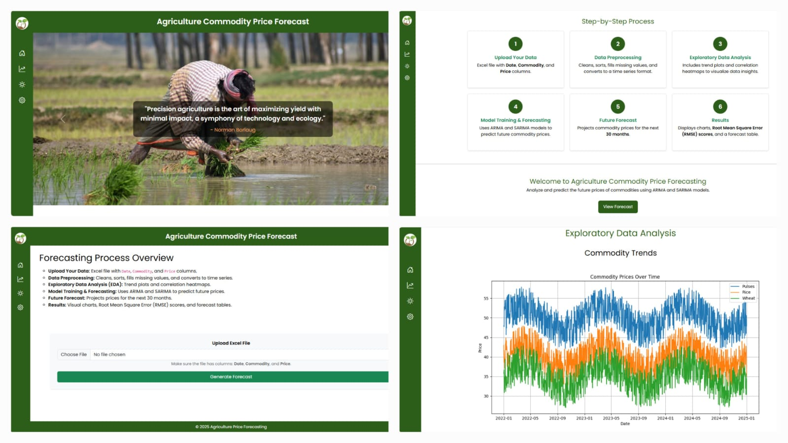

<<<<<<< HEAD


# 🌾 Agricultural Commodity Prices Forecasting using ARIMA & SARIMA

A **Django-based web application** that forecasts agricultural commodity prices using **ARIMA** and **SARIMA** time-series models.  
This project helps analyze historical price trends and predict future prices to support **data-driven agricultural and business decisions**.

---

## 📌 Introduction

Agricultural commodity prices are influenced by seasonality, demand, and market dynamics.  
Forecasting these prices helps farmers, traders, and policymakers make informed decisions.

This project integrates **ARIMA** and **SARIMA** forecasting models into a **Django web application** for interactive analysis.

---

## ❓ Problem Statement

- High price volatility in agricultural markets  
- Lack of reliable forecasting tools  
- Difficulty in identifying trends and seasonality  

---

## 🎯 Objectives

- Analyze historical commodity price data  
- Forecast future prices using ARIMA and SARIMA  
- Provide a web-based forecasting interface  
- Visualize trends, forecasts, and errors  

---

## ✨ Features

- 📈 ARIMA & SARIMA forecasting  
- 📁 Excel dataset upload  
- 📊 Forecast and trend visualization  
- 📉 RMSE-based evaluation  
- 🌐 User-friendly Django interface  

---

## 🛠️ Technologies Used

- Python  
- Django  
- Pandas  
- NumPy  
- Statsmodels  
- Matplotlib  
- Seaborn  
- SQLite  

---

## 🏗️ Project Architecture

User → Web Interface → Django Views → Data Processing → Forecast Models → Results

---

## 📂 Project Structure

```
agricultural-commodity-prices-forecasting-using-ARIMA-SARIMA/
├── agri_forecast/
├── forecast/
├── commodity_prices.xlsx
├── db.sqlite3
├── manage.py
├── requirements.txt
└── README.md
```

---

## 📊 Dataset Description

Excel file containing historical commodity prices.

| Date | Commodity | Price |
|-----|----------|-------|

---

## 🤖 Models Used

- **ARIMA** – Trend-based forecasting  
- **SARIMA** – Seasonal time-series forecasting  

---

## ⚙️ Installation & Setup

```bash
git clone https://github.com/harishsubburaj/agricultural-commodity-prices-forecasting-using-ARIMA-SARIMA.git
cd agricultural-commodity-prices-forecasting-using-ARIMA-SARIMA
python -m venv venv
venv\Scripts\activate
pip install -r requirements.txt
```

---

## ▶️ How to Run the Project

```bash
python manage.py migrate
python manage.py runserver
```

Open:
```
http://127.0.0.1:8000/
```

---

## 🧪 Model Evaluation

- Root Mean Squared Error (RMSE)  
- Forecast vs Actual plots  
- Residual analysis  

---

## 📈 Results & Output

- Commodity-wise forecast graphs  
- Trend and seasonality visualization  
- Error metrics display  

---

## 🚀 Future Enhancements

- LSTM / Deep Learning models  
- Real-time data integration  
- Interactive dashboards  
- Cloud deployment  

---

## 🌍 Applications

- Agricultural planning  
- Market trend analysis  
- Farmer decision support  
- Academic research  

---

## 📜 License

MIT License

---

## 👨‍💻 Author

**Harish Subburaj**  
GitHub: https://github.com/harishsubburaj
**Hari rudhran** 
GitHub: https://github.com/harirudhran

=======
# agriculture-price-forecasting
Time series forecasting of agricultural commodity prices using ARIMA and SARIMA models with data analysis and visualization.
# 🌾 Agricultural Commodity Price Forecasting using ARIMA & SARIMA

## 📌 Overview
This project focuses on predicting agricultural commodity prices using time series forecasting techniques. It uses ARIMA and SARIMA models to analyze historical data and forecast future price trends.

---

## 🎯 Objective
- Predict future prices of agricultural commodities
- Help farmers and traders make informed decisions
- Analyze seasonal trends and patterns in price data

---

## 🛠️ Tech Stack
- Python
- Pandas
- NumPy
- Matplotlib
- Statsmodels
- Jupyter Notebook

---

## 📊 Features
- Data preprocessing and cleaning
- Time series visualization
- Stationarity check (ADF Test)
- ARIMA model implementation
- SARIMA model for seasonal forecasting
- Performance evaluation

---
>>>>>>> 9067c7587925ace146314a8f74d9c22f5f520be6
